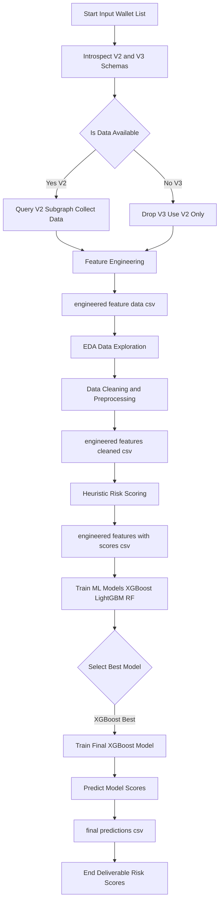

# Wallet-Risk-Scoring-from-Scratch
queries crypto subgraphs for details of a list of 100 wallets , uses heuristic based scoring for risk ( 1 being safest and 1000 being riskiest) and then trains a XGboost model for final predictive scoring. 

--- 

# Note : For Scoring ***1 is BEST*** and ***1000 is RISKIEST***

---

### Workflow : 

---

### Project Summary : 

# Compound V2 Wallet Risk Scoring

This project delivers a complete pipeline for data-driven risk scoring of wallets interacting with the Compound V2 protocol on Arbitrum, leveraging on-chain data, feature engineering, advanced analytics, and machine learning.

---

## Project Summary

I have built a robust system to score DeFi wallets by their protocol risk, using publicly-available subgraph data. The process involved:

- **Subgraph schema introspection:** Ran GraphQL introspection on multiple Compound V2/V3 subgraphs to determine extractable features.
- **Data sourcing:** Queried on-chain V2 data for 100+ wallets using custom Python scripts. Despite testing several V2/V3 endpoints, only one V2 subgraph provided results for all target wallets; no V3 subgraph yielded matching data, so the workflow adapted as V2-only.
- **Feature engineering:** Transformed raw transaction and position data into key wallet features capturing supply/borrow habits, health, protocol engagement, and risk indicators.
- **Exploratory analysis and cleaning:** Used EDA to understand distributions, outliers, and missingness. Cleaned and preprocessed the feature set with clipping, log transforms, and redundancy removal to boost ML and heuristic accuracy.
- **Heuristic scoring:** Crafted a transparent, domain-informed risk scoring system summarizing wallet risk (1 = safest, 1000 = riskiest) based on normalized, weighted features.
- **Model benchmarking:** Compared XGBoost, LightGBM, and Random Forest regressors; XGBoost yielded the best performance (lowest RMSE, highest R²).
- **Final risk scoring:** Trained XGBoost on the engineered features and output a deliverable file assigning a refined, data-driven risk score to every wallet.

---

## Tech Stack

- **Python 3**: All data processing, cleaning, feature engineering, and scripts
- **Pandas & Numpy**: Data wrangling and numerical transformations
- **Jupyter/Google Colab**: EDA, cleaning, modeling
- **xgboost, lightgbm, scikit-learn**: Machine learning training and evaluation
- **The Graph API (GraphQL)**: On-chain data sourcing from Compound V2 subgraph

---

## Outcomes & Impact

- **Transparent, explainable risk scores** for DeFi wallets, straightforward to interpret and operationalize in risk/compliance use cases.
- **Robust to outliers and data quality issues**—clipping and normalization prevent “whale” wallets or inactivity from skewing results.
- **Flexible processing pipeline**—can incorporate additional subgraph data (e.g., Compound V3 or other protocols) with trivial edits.
- **ML-backed improvement of expert heuristics**—learned model further refines risk quantification above rules alone.

---

## Why it matters

This pipeline enables any analyst or product team to quickly evaluate wallet safety, lending risk, or user reliability in DeFi—helping protocols, auditors, and risk officers safeguard lending markets against volatile or exploitative actors. The modular architecture ensures ongoing applicability as subgraph ecosystems and on-chain behaviors evolve.

---

## Limitations

- **Whale Accounts:** The presence of a few wallets with extremely large supply or borrow amounts (“whales”) dominated feature distributions despite normalization efforts. This skew may have reduced the model’s accuracy for typical (“retail”) wallets and made risk boundaries less clear for outliers.
- **Inactive or Dead Accounts:** Many wallets in the dataset showed minimal or no activity, leading to clusters of default or zero values in key features. As a result, distinguishing meaningful risk among these accounts was less reliable, and score granularity suffered.
- **Small Test Case Size:** The overall dataset was relatively small, with just over 100 wallets. This limited the diversity of unique behavioral patterns and made robust model training and validation more challenging. Larger, more varied datasets would likely improve score calibration and generalizability.
