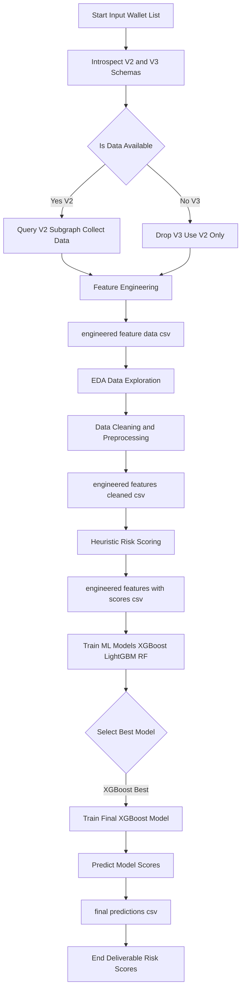

# Wallet-Risk-Scoring-from-Scratch
queries crypto subgraphs for details of a list of 100 wallets , uses heuristic based scoring for risk ( 1 being safest and 1000 being riskiest) and then trains a XGboost model for final predictive scoring. 

--- 

# Note : For Scoring ***1 is BEST*** and ***1000 is RISKIEST***

---

### Workflow : 

